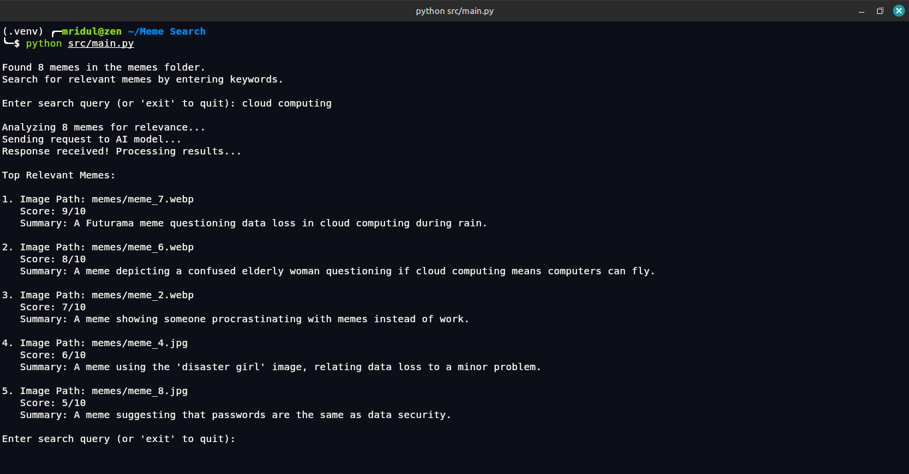

# Meme Search

A command-line tool to search through your local meme collection using Google's Gemini AI model. The tool analyzes memes based on your search query and provides relevancy scores and summaries to help you find the right meme quickly.



## Features

- 🔍 Search through local meme files using natural language queries
- 🤖 Powered by Google's Gemini AI model for accurate meme analysis
- 📊 Get relevancy scores for each meme (0-10)
- 📝 Receive concise summaries of meme content
- 🖼️ Supports multiple image formats (PNG, JPG, JPEG, GIF, WEBP)

## Prerequisites

- Python 3.8 or higher
- Google API Key (Gemini API access)
- Local collection of memes in a `memes` folder

## Installation

1. Clone the repository

2. Make a Virtual Environment
`python -m venv .venv`

3. Activate the Virtual Environment
`source .venv/bin/activate`

4. Install the required dependencies:
   ```bash
   pip install -r requirements.txt
    ```

5. Set up your Google API key:
   - Create a new API key in the Google Cloud Console.
   - Add the API key to the `.env` file in the root directory.

6. Run the script:
   ```bash
   python src/main.py
   ```

## Usage

- Enter your search query when prompted.
- The tool will analyze the memes and display the top 5 most relevant ones with their scores and summaries.
- You can continue searching or exit by typing 'exit'.