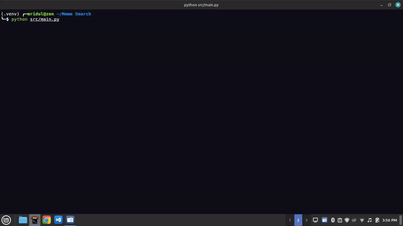

# Meme Search

A command-line tool to search through your local meme collection using CLIP embeddings and Google's Gemini AI model. The tool first uses CLIP to find similar memes based on your query, then uses Gemini to analyze and rank them.



## Features

- 🔍 Semantic search through local meme files using CLIP embeddings
- 🤖 Powered by Google's Gemini AI model for accurate meme analysis
- 📊 Get relevancy scores for each meme (0-10)
- 📝 Receive concise summaries of meme content
- 🖼️ Supports multiple image formats (PNG, JPG, JPEG, GIF, WEBP)
- ⚡ Fast search using FAISS vector database
- 💾 Saves embeddings for quick subsequent searches

## How It Works

1. First run: Creates CLIP embeddings for all memes and stores them in a FAISS index
2. Searches: Uses CLIP to find semantically similar memes to your query
3. Analysis: Uses Gemini to analyze and rank the most relevant memes
4. Results: Shows file paths, relevancy scores, and summaries

## Prerequisites

- Python 3.8 or higher
- Google API Key (Gemini API access)
- Local collection of memes in a `memes` folder
- CUDA-capable GPU recommended (but CPU works too)

## Installation

1. Clone the repository:

2. Create and activate a virtual environment:
   ```bash
   python -m venv .venv
   
   # On Windows:
   .venv\Scripts\activate
   # On macOS/Linux:
   source .venv/bin/activate
   ```

3. Install the required dependencies:
   ```bash
   pip install -r requirements.txt
   ```

4. Set up your Google API key:
   - Create a new [API key](https://aistudio.google.com/apikey)
   - Create a `.env` file in the root directory
   - Add your API key: `GOOGLE_API_KEY=your_key_here`

5. Add your memes:
   - Create a `memes` folder in the project root
   - Add your meme images (supported formats: PNG, JPG, JPEG, GIF, WEBP)

6. Run the script:
   ```bash
   python src/main.py
   ```

## Usage

1. First run will create embeddings for all memes (this may take a while)
2. Subsequent runs will load the saved embeddings instantly
3. Enter your search query when prompted
4. Get top 5 most relevant memes with:
   - File path
   - Relevancy score (0-10)
   - Brief description
5. Type 'exit' to quit

## Example

```bash
Found 100 memes in the memes folder.
Search for relevant memes by entering keywords.

Enter search query (or 'exit' to quit): programming bugs

Top Relevant Memes:

1. Image Path: memes/debug_meme.jpg
   Score: 9/10
   Summary: Developer surrounded by bug reports

2. Image Path: memes/coffee_debug.png
   Score: 8/10
   Summary: Debugging with coffee addiction
```
---
